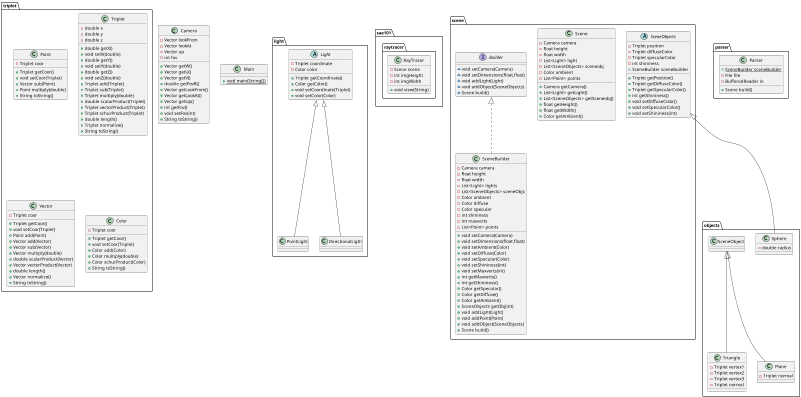
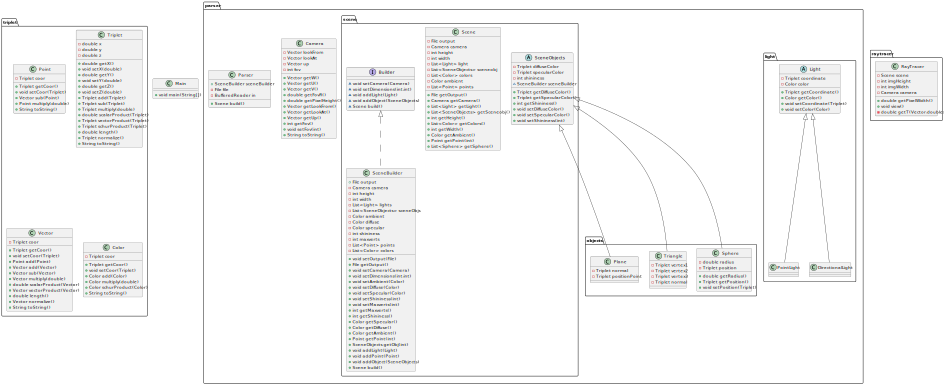
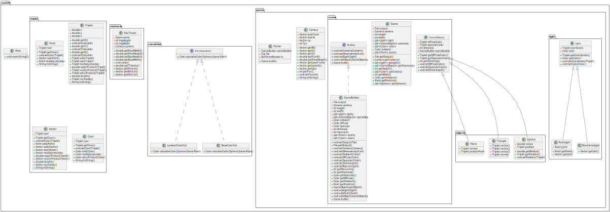

# SAE 3.01 Ray Tracer Implementation

SAE 3.01: Implementation of an application. We need to create a ray tracer that generates an image from text.

### Skills Mobilized :
#### Skill 1: Develop an application.
#### Skill 2: Optimize applications.
#### Skill 6: Collaborate within an IT team.

## 🛠️ Tools
- [Java](https://www.java.com/fr/)
- [Intellij](https://www.jetbrains.com/idea/)

## 🛠️ Start
```bash
git clone https://gitlab.univ-artois.fr/anthony_rolland/sae1.01-groupe13.git
```
You can choose a shape to generate with a given text file as an argument.

```bash
bash scripts/exec.sh votreforme.txt
```

## 🙇 Authors
- Louis Karamucki: [@louis_karamucki](mailto:louis_karamucki@ens.univ-artois.fr)
- Romain Guiffroy: [@matteo_guiffroy](mailto:matteo_guiffroy@ens.univ-artois.fr)
- Anthony Rolland: [@anthony_rolland](mailto:anthony_rolland@ens.univ-artois.fr)
- Damien Allaert [@damien_allaert](mailto:damien_allaert@ens.univ-artois.fr)
        
## Class Diagram
We will place class diagrams here based on our progress in the project.

- Day 1 (Monday, 23 octobre):


- Day 2 (Tuesday, 24 octobre):


- Day 3 (Wednesday, 25 octobre):

